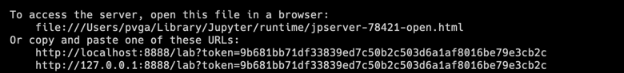

### Environment Set up

1. Run MongoDB locally
    
    1. pull mongo db image `docker pull arm64v8/mongo`. This image is for Apple M2 chips macbooks.
    2. docker run -p 27017:27017 --name some-mongo -d arm64v8/mongo:tag

2. Install MongoDB Compass to view MongoDB thru a UI - https://www.mongodb.com/try/download/compass
3. Install Jupyter Lab - `pip install jupyterlab`. Refer this page for more information: [Jupyter Installation](https://jupyterlab.readthedocs.io/en/stable/getting_started/installation.html). If you are using VS Code, you can install Jupytrer lab extension, and VS Code has natove support for Jupyter notebooks, which is better than other ways of running jupyter notebooks (in browser or as python).

4. Start Jupyter Lab from the root *microlearnings-jupyter* of this project folder. This step is not required if you are using Jupyter extension in VS Code.
5. Jupyter labs can be accessed thru a web browser. A message like the following will appear in the console when Jupyter labs is started. You can use the localhost link. This step is not required if you are using Jupyter extension in VS Code.
    > 

---

### How to run

1. Start the kafka consumers. They will consume from required topics and insert into local MongoDB.
2. Then, execute MicroLearnings from the Jupyter Notebooks.

---

### How to

1. Query on the basis of client_transaction_id:
{ "posting_instruction_batch.posting_instructions.client_transaction_id": "f9ea38b6-59a8-497d-9a43-dd907adb28d6" }

---
### rough notes

Apple M2 chip compatible mongodb - https://hub.docker.com/r/arm64v8/mongo/

    docker pull arm64v8/mongo
    docker run -p 27017:27017 --name some-mongo -d arm64v8/mongo:tag
    docker exec -it some-mongo mongosh

Download MongoDB UI from here - https://www.mongodb.com/try/download/compass

Commands

    docker port container_name -> shows the port mapping of a running container
    arch -> find architecture of your macbook. ENUM [arm64, x86]

Run Kowl UI - `docker run -p 8082:8080 -e KAFKA_BROKERS=bootstrap.kafka.partner-eph-6.tmachine.io:443 -e KAFKA_TLS_ENABLED=true quay.io/cloudhut/kowl:master`

Run jupyter notebook

    docker run                  \
    --rm -p 8888:8888           \
    -e JUPYTER_ENABLE_LAB=yes   \
    -v "$PWD":/home/pvga/work \
    jupyter/datascience-notebook

    A -> change the name of the image\

    Run the following commands in the work folder

        python3 -m venv venv
        source venv/bin/activate
        python3 -m pip install -r requirements.txt

Run kafkacat

    docker run --rm confluentinc/cp-kafkacat kafkacat -b bootstrap.kafka.partner-eph-6.tmachine.io:443 -t vault.api.v1.customers.customer.created -C

### Errors and Solutions ->

    no broker available 
    (S)olution -> added - api_version = (0, 8, 2))

    certificate verify failed: unable to get local issuer certificate
    S -> https://stackoverflow.com/questions/52805115/certificate-verify-failed-unable-to-get-local-issuer-certificate   

    UnsupportedCodecError: UnsupportedCodecError: Libraries for snappy compression codec not found
    S ->
        install python-snappy in jupyter
        	%%bash
        	pip install python-snappy

    timeout  - docker pull mongodb/mongodb-community-server
    S -> disconnect vpn

    connection refused for mongo db container
    S -> specify -p 27017:27017 while running docker

---

### rough copy-paste

# Parse received data from Kafka
for msg in consumer:
    record = json.loads(msg.value)
    name = record['name']
    shop = record['shop']
    phoneNumber = record['phoneNumber']
    address = record['phoneNumber']
    pizzas = record['pizzas']
    
    # Create dictionary and ingest data into MongoDB
    try:
       pizza_rec = {'name':name,'shop':shop,'phoneNumber':phoneNumber,'address':address,'pizzas' :pizzas}
       rec_id1 = db.coba_info.insert_one(pizza_rec)
       print("Data inserted with record ids", rec_id1)
    except:
       print("Could not insert into MongoDB")

# consumer event and write to mondo db

# Import some necessary modules
from pymongo import MongoClient
import json
from pprint import pprint

def main():
    # Connect to MongoDB and vault_customer database
    try:
        client = MongoClient('localhost', 27017)
        db = client.pizza_rec
        print(client.list_database_names())
        print("Connected successfully!")
    except:
        print("Could not connect to MongoDB")

    name = 'Pooja'
    shop = 'demo-shop'
    phoneNumber = '8800988166'
    address = 'gurgaon'
    pizzas = '5 pizzaass'

    # Create dictionary and ingest data into MongoDB
    try:
        # pizza_rec = {'name': name, 'shop': shop, 'phoneNumber': phoneNumber, 'address': address, 'pizzas': pizzas}
        pizza_rec = json.loads('''
        {
            "id": "1503821867142587933",
            "status": "CUSTOMER_STATUS_ACTIVE",
            "identifiers": [
                {
                    "identifier_type": "IDENTIFIER_TYPE_EMAIL",
                    "identifier": "agvp14@test.com"
                }
            ],
            "customer_details": {
                "title": "CUSTOMER_TITLE_MISS",
                "first_name": "Twoj",
                "middle_name": "",
                "last_name": "Stary",
                "dob": "1956-01-08",
                "gender": "CUSTOMER_GENDER_UNKNOWN",
                "nationality": "British",
                "email_address": "",
                "mobile_phone_number": "+4464947779",
                "home_phone_number": "+44310370076",
                "business_phone_number": "+44347816009",
                "contact_method": "CUSTOMER_CONTACT_METHOD_UNKNOWN",
                "country_of_residence": "GB",
                "country_of_taxation": "GB",
                "accessibility": "CUSTOMER_ACCESSIBILITY_UNKNOWN",
                "external_customer_id": ""
            },
            "additional_details": {}
        }
        ''')

        # rec_id1 = db.coba_info.insert_one(pizza_rec)
        # print("Data inserted with record ids", rec_id1)
    except:
        print("Could not insert into MongoDB")

    id = '1503821867142587933'
    myCursor = db.coba_info.find({'id': id})

    for document in myCursor:
        pprint(document)

if __name__ == '__main__':
    main()

{
    "request_id": "{{$guid}}",
    "customer": {
        "status": "{{status}}",
        "identifiers": [
            {
                "identifier_type": "{{identifier_type}}",
                "identifier": "{{$randomEmail}}"
            }
        ],
        "customer_details": {
            "title": "{{title}}",
            "first_name": "Twoj",
            "middle_name": "",
            "last_name": "Stary",
            "dob": "{{dob}}",
            "gender": "{{gender}}",
            "nationality": "British",
            "email_address": "{{$randomEmail}}",
            "mobile_phone_number": "+44{{randomMobilePhoneNumber}}",
            "home_phone_number": "+44{{randomHomePhoneNumber}}",
            "business_phone_number": "+44{{randomBusinessPhoneNumber}}",
            "contact_method": "{{contact_method}}",
            "country_of_residence": "GB",
            "country_of_taxation": "GB",
            "accessibility": "{{accessibility}}",
            "external_customer_id": null
        },
        "additional_details": {}
    }
}

{
    "request_id": "{{$guid}}",
    "customer": {
        "status": "CUSTOMER_STATUS_ACTIVE",
        "identifiers": [
            {
                "identifier_type": "{{identifier_type}}",
                "identifier": "test@email.com"
            }
        ],
        "customer_details": {
            "title": "CUSTOMER_TITLE_MR",
            "first_name": "pvga",
            "middle_name": "",
            "last_name": "gft"
        },
        "additional_details": {}
    }
